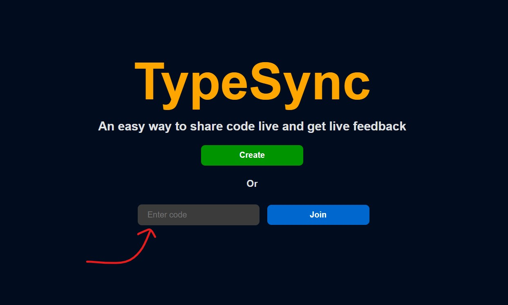

# TypeSync

A simple web app to sync text across multiple devices.

The idea is that there is a broadcaster who types in code and listeners who see the code in real time. Sort of like a text-only Google Meet. Backend is written in **Go** and frontend is written in **Svelte**. This could be particularly useful for teaching and learning.

This repo contains the backend code.

Find the frontend code [here](https://github.com/RohitEdathil/syncfront).

## Features

- Broadcast code from a broadcaster to multiple listeners
- Broadcaster can see how many listeners are connected
- Listeners can let the broadcaster know if they are able to follow along

## [Demo](https://typesync.vercel.app/) 🪄

## Usage

## Broadcaster

### 1. Create a TypeSync room

### 2. Share the room link with your listeners

### 3. Start typing, press "Send" (Or Ctrl + Enter) to send the code

### 4. See how many listeners are connected and how many are following along

## Listener

### 1. Go to the room link shared by the broadcaster (Or enter the room code)

### 2. Let the broadcaster know if you are able to follow along (Press to toggle)

## Notes

If there are no listeners, broadcaster closes the tab, and is not seen for 30 minutes, the room will be deleted within a another 30 minutes.

## Frameworks and Libraries

- [Gin](https://github.com/gin-gonic/gin) : Web framework
- [WebSockets](https://github.com/gorilla/websocket) : For real-time communication

## Why?

- I thought this would be a fun project to work on
- I wanted to learn Go
- I wanted to get better at backend development
- I wanted to learn Svelte (Not really, but was a good excuse to learn it)
- I wanted to showcase my skills in improving a prduct (i.e. More updates to come)

## Contributing

Please feel free to open an issue or a PR if you have any suggestions or improvements.
Also, if you find any bugs, please open an issue.
